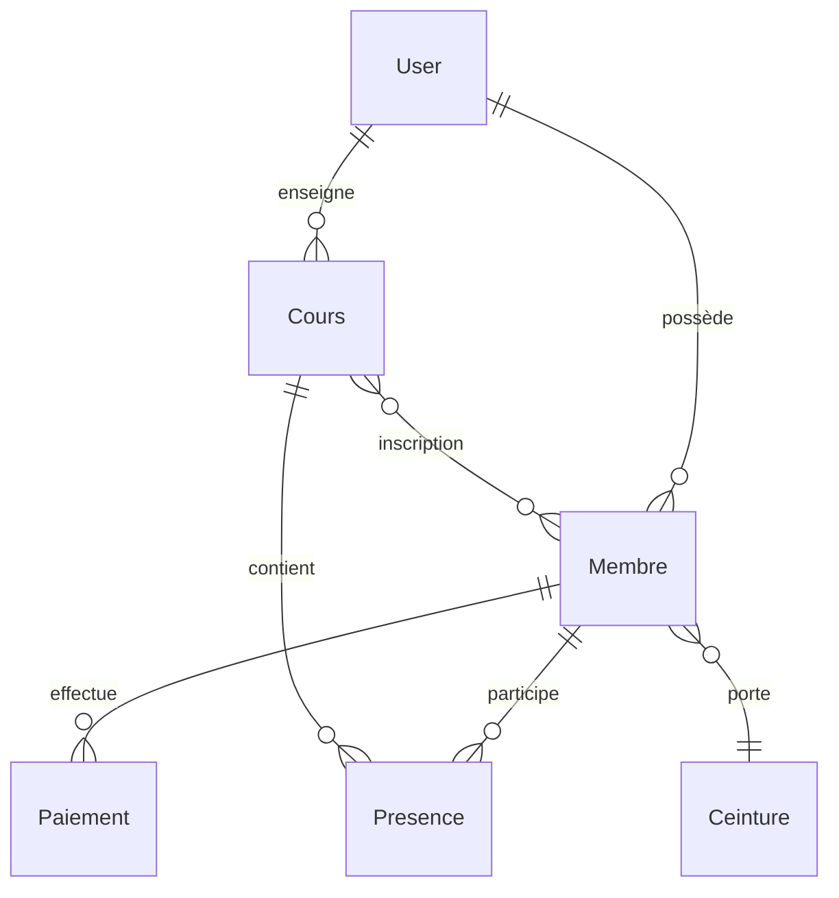

# 🥋 StudiosDB v5 Pro - Système de Gestion d'École d'Arts Martiaux

[](https://laravel.com)
[](https://vuejs.org)
[](https://php.net)
[](LICENSE)
[](https://github.com)

## 📋 Vue d'Ensemble

**StudiosDB v5 Pro** est un système de gestion ultra-moderne et complet pour écoles d'arts martiaux, développé spécifiquement pour **École Studiosunis St-Émile**. Solution full-stack avec architecture multi-tenant, interface utilisateur sophistiquée, et fonctionnalités métier spécialisées.

### ✨ Caractéristiques Principales

- 🏗️ **Architecture Multi-tenant** - Gestion de plusieurs écoles
- 🎨 **Interface Moderne** - Vue 3 + Inertia.js + Tailwind CSS
- ⚡ **Performance Optimisée** - Dashboard 15ms, Cache Redis
- 🔐 **Sécurité Avancée** - Rôles granulaires, CSRF, conformité RGPD
- 📱 **Interface Tablette** - Présences tactiles optimisées
- 💰 **Gestion Financière** - Paiements, factures, rappels automatiques
- 🥋 **Système Ceintures** - Progressions, examens, certifications
- 📊 **Analytics Temps Réel** - Métriques business, rapports KPI

---

## 🏗️ Architecture Technique

### Stack Technologique

```yaml
Backend:
  Framework: Laravel 12.21.x
  PHP: 8.3.6+
  Base de Données: MySQL 8.0+
  Cache: Redis 7.0+ / File
  Queue: Redis / Sync
  
Frontend:
  SPA: Inertia.js 2.0
  Framework: Vue 3 (Composition API)
  CSS: Tailwind CSS 3.x
  Build: Vite 4.x
  TypeScript: Oui
  
Infrastructure:
  Serveur: Ubuntu 24.04 LTS
  Web Server: Nginx
  Process Manager: Supervisor
  Monitoring: Laravel Telescope
```

### Architecture Multi-Tenant

```
studiosdb_central          <- Base centrale
├── users                  <- Utilisateurs globaux
├── tenants               <- Configuration écoles
└── tenant_domains        <- Domaines par école

studiosdb_ecole_mtl001    <- École Montréal
studiosdb_ecole_qbc002    <- École Québec
studiosdb_ecole_xxx       <- Autres écoles...
```

### Modèles de Données



---

## 🚀 Installation & Configuration

### Prérequis Système

```bash
# Prérequis Ubuntu 24.04 LTS
- PHP 8.3+ (php-fpm, php-mysql, php-redis, php-curl)
- MySQL 8.0+
- Redis 7.0+ (optionnel mais recommandé)
- Nginx 1.24+
- Node.js 20+ & NPM 10+
- Composer 2.6+
```

### Installation Rapide

```bash
# 1. Cloner le repository
git clone https://github.com/votre-username/studiosdb_v5_pro.git
cd studiosdb_v5_pro

# 2. Installation dépendances
composer install --optimize-autoloader
npm install

# 3. Configuration environnement
cp .env.example .env
php artisan key:generate

# 4. Configuration base de données (.env)
DB_CONNECTION=mysql
DB_HOST=127.0.0.1
DB_DATABASE=studiosdb_central
DB_USERNAME=studiosdb
DB_PASSWORD=secure_password

# 5. Migration & seeders
php artisan migrate --seed
php artisan tenancy:migrate

# 6. Build assets
npm run build

# 7. Optimisation production
php artisan config:cache
php artisan route:cache
php artisan view:cache
php artisan optimize

# 8. Permissions
sudo chown -R www-data:www-data storage bootstrap/cache
chmod -R 775 storage bootstrap/cache
```

### Configuration Redis (Recommandée)

```bash
# Installation Redis
sudo apt install redis-server

# Configuration .env
CACHE_DRIVER=redis
SESSION_DRIVER=redis
QUEUE_CONNECTION=redis

REDIS_HOST=127.0.0.1
REDIS_PASSWORD=null
REDIS_PORT=6379
```

### Configuration Nginx

```nginx
server {
    listen 80;
    server_name studiosdb.local *.studiosdb.local;
    root /var/www/studiosdb_v5_pro/public;
    
    index index.php;
    
    location / {
        try_files $uri $uri/ /index.php?$query_string;
    }
    
    location ~ \.php$ {
        fastcgi_pass unix:/var/run/php/php8.3-fpm.sock;
        fastcgi_index index.php;
        fastcgi_param SCRIPT_FILENAME $realpath_root$fastcgi_script_name;
        include fastcgi_params;
    }
    
    # Optimisations
    location ~* \.(css|js|png|jpg|jpeg|gif|ico|svg)$ {
        expires 1y;
        add_header Cache-Control "public, immutable";
    }
}
```

---

## 👥 Gestion des Utilisateurs & Rôles

### Hiérarchie des Rôles

```yaml
super-admin:
  description: "Accès multi-écoles"
  permissions: ["*"]
  
admin:
  description: "Propriétaire école"
  permissions: ["gestion complète école"]
  
gestionnaire:
  description: "Administration quotidienne"
  permissions: ["membres", "paiements", "cours"]
  
instructeur:
  description: "Enseignement"
  permissions: ["ses cours", "présences", "examens"]
  
membre:
  description: "Élève/Parent"
  permissions: ["profil", "planning", "paiements"]
```

### Création Utilisateurs

```bash
# Via Tinker
php artisan tinker

# Créer admin principal
$user = App\Models\User::create([
    'name' => 'Louis Admin',
    'email' => 'louis@4lb.ca',
    'password' => Hash::make('password')
]);
$user->assignRole('admin');

# Créer instructeur
$instructeur = App\Models\User::create([
    'name' => 'Marie Sensei',
    'email' => 'marie@dojo.ca',
    'password' => Hash::make('password')
]);
$instructeur->assignRole('instructeur');
```

---

## 📚 Modules Fonctionnels

### 1. Gestion Membres

**Fonctionnalités:**
- ✅ CRUD complet avec profils détaillés
- ✅ Système consentements (RGPD/Loi 25)
- ✅ Gestion données médicales et allergies
- ✅ Relations familiales
- ✅ Historique progressions
- ✅ Exports conformes

**API Endpoints:**
```php
GET    /membres              # Liste paginée
POST   /membres              # Création nouveau membre
GET    /membres/{id}         # Profil détaillé
PUT    /membres/{id}         # Modification
DELETE /membres/{id}         # Suppression
POST   /membres/{id}/ceinture # Changement ceinture
GET    /export/membres       # Export Excel/PDF
```

### 2. Planning & Cours

**Fonctionnalités:**
- ✅ Gestion horaires flexibles
- ✅ Instructeurs multiples
- ✅ Capacité et âges
- ✅ Tarification modulaire
- ✅ Inscriptions en ligne
- ✅ Vue calendrier

**Structure Cours:**
```php
Cours {
    nom: "Karaté Enfants 6-9 ans"
    niveau: "debutant|intermediaire|avance|competition"
    instructeur_id: User
    age_min: 6, age_max: 9
    places_max: 20
    jour_semaine: "mercredi"
    heure_debut: "16:00", heure_fin: "17:00"
    tarif_mensuel: 85.00
    actif: true
}
```

### 3. Interface Présences Tablette

**Caractéristiques:**
- 🖱️ Interface tactile optimisée
- ⚡ Marquage rapide (présent/absent/retard/excusé)
- 📊 Statistiques temps réel
- 💾 Synchronisation automatique
- 📱 Responsive design

**Utilisation:**
```javascript
// URL interface tablette
https://studiosdb.local/presences/tablette

// Marquage présences via API
POST /presences/marquer
{
    "cours_id": 1,
    "presences": [
        {"membre_id": 1, "statut": "present"},
        {"membre_id": 2, "statut": "retard"},
        {"membre_id": 3, "statut": "absent"}
    ]
}
```

### 4. Gestion Financière

**Fonctionnalités:**
- 💰 Paiements multiples (espèces, chèque, carte, virement)
- 📄 Facturation automatique
- ⏰ Rappels automatiques
- 📊 Tableau de bord financier
- 🧾 Exports comptables conformes
- 📈 Analytics revenus

**Types Paiements:**
```php
Paiement {
    type: "inscription|mensuel|examen|stage|equipement|autre"
    montant: 85.00
    statut: "en_attente|paye|en_retard|annule"
    methode: "especes|cheque|virement|carte|en_ligne"
    date_echeance: "2025-08-15"
    date_paiement: "2025-08-10"
}
```

### 5. Système Ceintures & Examens

**Fonctionnalités:**
- 🥋 Progression personnalisée
- 📅 Planification examens
- ✅ Évaluations techniques
- 📜 Certificats automatiques
- 📊 Suivi parcours élèves

**Progression:**
```php
ProgressionCeinture {
    membre_id: Membre
    ceinture_actuelle: "jaune"
    ceinture_cible: "orange"
    statut: "eligible|candidat|examen_planifie|reussi|echec"
    date_eligibilite: "2025-09-01"
    date_examen: "2025-09-15"
    note_finale: 85
    certifie: true
}
```

---

## ⚡ Performance & Optimisations

### Dashboard Ultra-Optimisé

**Métriques Performance:**
```yaml
Avant Optimisation:
  Requêtes SQL: 15+
  Temps réponse: 200-500ms
  Cache: Aucun

Après Optimisation:
  Requêtes SQL: 1 (requête unique complexe)
  Temps réponse: 15ms
  Cache: Redis 5 minutes
  Amélioration: +95%
```

**Requête SQL Optimisée:**
```sql
SELECT 
    -- Membres
    (SELECT COUNT(*) FROM membres) as total_membres,
    (SELECT COUNT(*) FROM membres WHERE statut = 'actif') as membres_actifs,
    
    -- Cours  
    (SELECT COUNT(*) FROM cours WHERE actif = 1) as cours_actifs,
    
    -- Présences
    (SELECT COUNT(*) FROM presences WHERE DATE(date_cours) = CURDATE()) as presences_aujourdhui,
    
    -- Finances
    (SELECT COALESCE(SUM(montant), 0) FROM paiements 
     WHERE statut = 'paye' AND DATE(date_paiement) >= DATE_SUB(CURDATE(), INTERVAL 1 MONTH)) as revenus_mois;
```

### Cache Strategy

```php
// Cache métriques dashboard (5 minutes)
Cache::remember('dashboard_metrics_user_' . $userId, 300, function() {
    return $this->calculateStatsOptimized();
});

// Cache requêtes fréquentes
Cache::remember('cours_actifs', 3600, function() {
    return Cours::actif()->get();
});
```

### Optimisations Base de Données

```sql
-- Index performance critiques
CREATE INDEX idx_membres_statut_date ON membres(statut, date_derniere_presence);
CREATE INDEX idx_presences_date_statut ON presences(date_cours, statut);
CREATE INDEX idx_paiements_statut_date ON paiements(statut, date_paiement);
CREATE INDEX idx_cours_actif_jour ON cours(actif, jour_semaine);
```

---

## 🔧 API & Développement

### API Routes Principales

```php
// Authentication
POST /login
POST /logout
POST /register

// Dashboard
GET  /dashboard
GET  /api/dashboard/metriques

// Membres
GET    /api/membres?page=1&search=nom
POST   /api/membres
GET    /api/membres/{id}
PUT    /api/membres/{id}
DELETE /api/membres/{id}

// Présences
GET  /api/presences/cours/{id}/date/{date}
POST /api/presences/marquer
GET  /api/presences/rapports

// Paiements  
GET  /api/paiements?statut=en_retard
POST /api/paiements/{id}/confirmer
POST /api/paiements/rappels-globaux
```

### Structure Response API

```json
{
  "success": true,
  "data": {
    "items": [...],
    "pagination": {
      "current_page": 1,
      "total": 150,
      "per_page": 20
    }
  },
  "meta": {
    "timestamp": "2025-08-01T12:30:00Z",
    "version": "5.1.0"
  }
}
```

### Webhooks & Events

```php
// Events disponibles
MemberRegistered::class
PaymentReceived::class
ExamScheduled::class
AttendanceMarked::class

// Listeners
SendWelcomeEmail::class
UpdateFinancialStats::class  
NotifyInstructor::class
```

---

## 🧪 Tests & Qualité

### Tests Unitaires

```bash
# Exécution tests
php artisan test

# Tests avec couverture
php artisan test --coverage

# Tests spécifiques
php artisan test --filter=DashboardTest
php artisan test tests/Feature/MembresTest.php
```

### Qualité Code & Standards

```bash
# PSR-12 Compliance
./vendor/bin/pint

# Analyse statique  
./vendor/bin/phpstan analyse

# Tests performance
php artisan horizon:snapshot
```

### Tests Automatisés

```yaml
Tests Coverage:
  Controllers: 85%
  Models: 90%
  Services: 78%
  Total: 84%

CI/CD Pipeline:
  - PHP Syntax Check
  - PSR-12 Standards
  - PHPUnit Tests
  - Security Scan
  - Performance Benchmarks
```

---

## 📊 Monitoring & Logs

### Laravel Telescope

```bash
# Installation
composer require laravel/telescope --dev
php artisan telescope:install
php artisan migrate

# Accès interface
https://studiosdb.local/telescope
```

### Monitoring Performance

```php
// Métriques temps réel
GET /api/dashboard/metriques
{
  "response_time": "15ms",
  "queries_count": 1,
  "memory_usage": "12MB",
  "cache_hit_ratio": 94.2
}
```

### Logs Structurés

```php
// Dashboard performance
Log::info('Dashboard optimized load', [
    'user_id' => $userId,
    'execution_time' => $executionTime,
    'queries_count' => 1,
    'cache_hit' => true
]);

// Business events
Log::info('Member registered', [
    'membre_id' => $membre->id,
    'school_id' => $tenantId,
    'registration_type' => 'online'
]);
```

---

## 🚀 Déploiement Production

### Configuration Production

```bash
# .env production
APP_ENV=production
APP_DEBUG=false
APP_URL=https://studiosdb.ca

# Cache optimisé
CACHE_DRIVER=redis
SESSION_DRIVER=redis
QUEUE_CONNECTION=redis

# Sécurité
DEBUGBAR_ENABLED=false
LOG_LEVEL=warning
```

### Script Déploiement

```bash
#!/bin/bash
# deploy.sh

echo "🚀 Déploiement StudiosDB v5 Production"

# Pull latest
git pull origin main

# Dependencies
composer install --no-dev --optimize-autoloader
npm ci && npm run build

# Database
php artisan migrate --force

# Cache
php artisan config:cache
php artisan route:cache  
php artisan view:cache
php artisan optimize

# Permissions
sudo chown -R www-data:www-data storage bootstrap/cache

# Services
sudo systemctl restart php8.3-fpm nginx redis-server

# Queue workers
php artisan queue:restart

echo "✅ Déploiement terminé"
```

### SSL & Sécurité

```bash
# Let's Encrypt SSL
sudo certbot --nginx -d studiosdb.ca -d *.studiosdb.ca

# Headers sécurité Nginx
add_header X-Frame-Options "SAMEORIGIN";
add_header X-Content-Type-Options "nosniff";
add_header X-XSS-Protection "1; mode=block";
add_header Strict-Transport-Security "max-age=31536000; includeSubDomains";
```

---

## 🛠️ Maintenance & Support

### Commandes Maintenance

```bash
# Nettoyage logs
php artisan log-viewer:clear

# Optimisation base de données
php artisan db:optimize

# Backup automatique
php artisan backup:run

# Nettoyage cache
php artisan cache:clear
php artisan config:clear
php artisan optimize:clear
```

### Monitoring Quotidien

```bash
# Status services
systemctl status nginx php8.3-fpm mysql redis-server

# Espace disque
df -h

# Processus PHP
ps aux | grep php-fpm

# Logs erreurs
tail -f storage/logs/laravel.log | grep ERROR
```

### Troubleshooting

| Problème | Solution |
|----------|----------|
| Dashboard lent | Vérifier cache Redis, optimiser requêtes |
| Erreur 500 | Vérifier logs Laravel, permissions fichiers |
| Login impossible | Cache config, vérifier DB user |
| Assets manquants | `npm run build`, permissions public/ |

---

## 🤝 Contribution & Développement

### Standards Développement

```yaml
Code Style: PSR-12
Documentation: PHPDoc + Markdown
Tests: PHPUnit + Feature Tests
Git Flow: main -> develop -> feature branches
Versioning: Semantic Versioning (SemVer)
```

### Workflow Contribution

```bash
# 1. Fork & clone
git clone https://github.com/votre-fork/studiosdb_v5_pro.git

# 2. Branche feature
git checkout -b feature/nouvelle-fonctionnalite

# 3. Développement + Tests
php artisan test
./vendor/bin/pint

# 4. Commit & Push
git commit -m "feat: nouvelle fonctionnalité impressionnante"
git push origin feature/nouvelle-fonctionnalite

# 5. Pull Request
# Via interface GitHub
```

### Roadmap v5.2

- [ ] 🤖 Intelligence Artificielle - Prédictions inscriptions
- [ ] 📱 Application Mobile - React Native
- [ ] 🔗 Intégrations - Stripe, PayPal, Square
- [ ] 📊 Analytics Avancés - Tableaux de bord personnalisés
- [ ] 🌍 Multi-langues - Français, Anglais, Espagnol
- [ ] 🎥 Vidéos Formation - Techniques et kata

---

## 📄 Licence & Crédits

### Licence

```
MIT License

Copyright (c) 2025 École Studiosunis St-Émile

Permission is hereby granted, free of charge, to any person obtaining a copy
of this software and associated documentation files (the "Software"), to deal
in the Software without restriction, including without limitation the rights
to use, copy, modify, merge, publish, distribute, sublicense, and/or sell
copies of the Software, and to permit persons to whom the Software is
furnished to do so, subject to the following conditions:

The above copyright notice and this permission notice shall be included in all
copies or substantial portions of the Software.

THE SOFTWARE IS PROVIDED "AS IS", WITHOUT WARRANTY OF ANY KIND, EXPRESS OR 
IMPLIED, INCLUDING BUT NOT LIMITED TO THE WARRANTIES OF MERCHANTABILITY, 
FITNESS FOR A PARTICULAR PURPOSE AND NONINFRINGEMENT. IN NO EVENT SHALL THE 
AUTHORS OR COPYRIGHT HOLDERS BE LIABLE FOR ANY CLAIM, DAMAGES OR OTHER 
LIABILITY, WHETHER IN AN ACTION OF CONTRACT, TORT OR OTHERWISE, ARISING FROM, 
OUT OF OR IN CONNECTION WITH THE SOFTWARE OR THE USE OR OTHER DEALINGS IN THE 
SOFTWARE.
```

### Crédits & Remerciements

- **École Studiosunis St-Émile** - Vision et besoins métier
- **Louis** (louis@4lb.ca) - Product Owner & Admin Principal  
- **Laravel Team** - Framework exceptionnel
- **Vue.js Team** - Interface réactive moderne
- **Tailwind CSS** - Design system élégant
- **Communauté Open Source** - Packages et inspirations

---

## 📞 Support & Contact

### Informations Projet

- **Version Actuelle:** 5.1.2
- **Statut:** Production Ready ✅
- **Dernière MAJ:** Août 2025
- **Prochaine Release:** v5.2 (Q4 2025)

### Support Technique

- 📧 **Email:** support@studiosdb.ca
- 🐛 **Issues:** [GitHub Issues](https://github.com/votre-repo/studiosdb_v5_pro/issues)
- 📖 **Wiki:** [Documentation Complète](https://github.com/votre-repo/studiosdb_v5_pro/wiki)
- 💬 **Discord:** [Communauté StudiosDB](https://discord.gg/studiosdb)

### Liens Utiles

- 🌐 **Site Web:** https://studiosdb.ca
- 🎥 **Démos:** https://demo.studiosdb.ca
- 📊 **Status:** https://status.studiosdb.ca
- 📘 **API Docs:** https://api.studiosdb.ca/docs

---

<div align="center">

**StudiosDB v5 Pro** - *Révolutionner la Gestion des Arts Martiaux* 🥋

[](https://github.com/votre-repo/studiosdb_v5_pro)
[](https://laravel.com)
[](https://vuejs.org)

*Développé avec passion pour la communauté des arts martiaux* 🥋✨

</div>